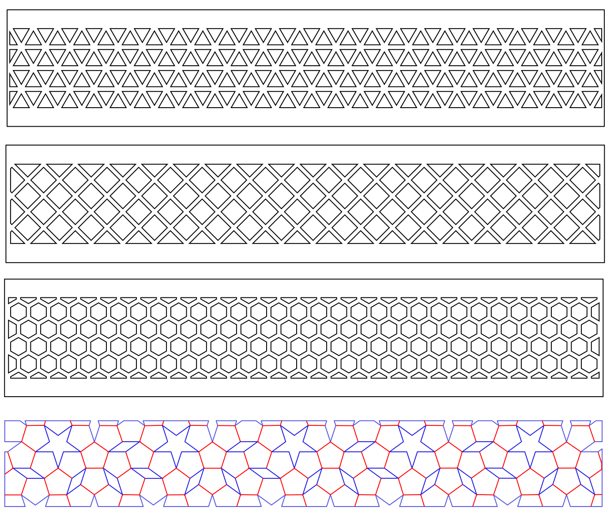

# What is this?

- A series of scripts to create tessellation patterns.
- Scripts to produce tessellations for laser cutting.

> This project was born when we built the stairs of our house/office.
> We had 60 steps to cover. Each step tells the story of a neat mathematical problem:
> The discovery of the `Einstein` or aperiodic monotile.

Each riser in the stair (the vertical part) is either laser-cut or laser-engraved with a pattern.
The stairs are divided in 7 sections:

### 1. Regular tessellations  (made of a single regular polygon)
Only three regular polygons can tessellate the plane without gaps or overlaps: equilateral triangles, squares, and regular hexagons. This is because only these shapes, when placed edge to edge, have interior angles that are exact divisors of 360°, allowing them to fit together perfectly in a repeating pattern.

The last example illustrates how pentagons leave star and rhombus holes in the plane.

### 2. Semi-regular tessellations (made of two or more regular polygons)

### 3. Symmetric tessellations (made of a single polygon with isometries of the plane)

### 4. Girih tiles with islamic/mudejar patterns

### 5. Socolar Aperiodic Tilings

### 6. P2 Penrose Aperiodic Tilings (with kites and darts)

With a script created by [tangentstorm](http://tangentstorm.com/)

which was used to create a room divider with a Penrose tiling:

### 7. Hat monotile aperiodic tiling (with a pattern)
